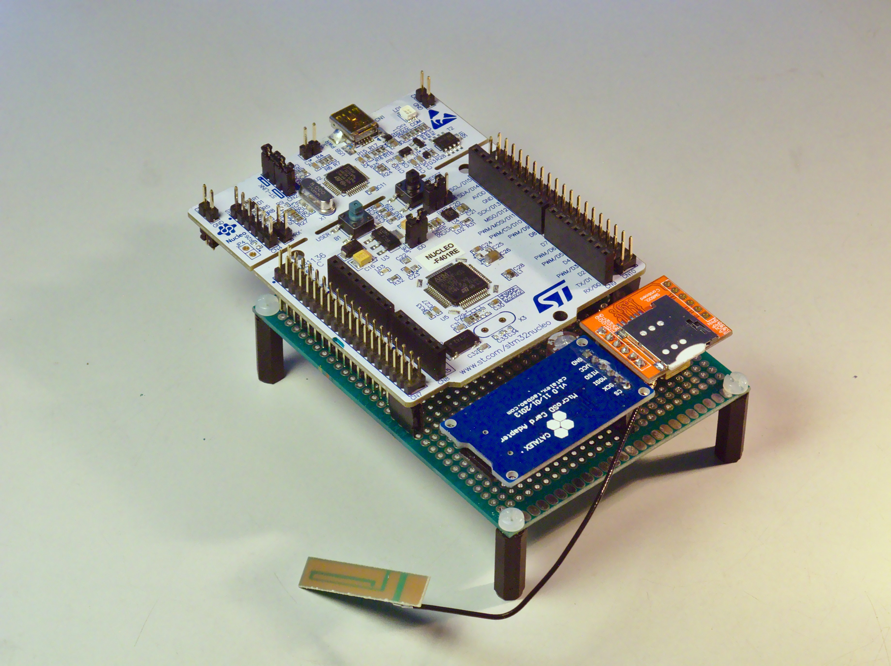

# Karana V2
Karana V2 is an open-source, cheap and easily extendable hardware and software framework for data acquisition based on the well known STM32 microcontrollers.  
  

## Problem statement
* Researchers need an open, accessible data acquisition platform
* Technical providers are missing real-time system performance data
* Policy makers are missing data about rural energy usage behavior
* Proprietary monitoring devices are expensive, or cause lock-in

## Solution 

ME Karana is an open source monitoring and data acquisition platform for Solar
Home Systems, Micro Wind Turbine, Biogas, Improved Cooking Stoves and other
energy access related sources such as diesel generator. It was developed as a low-
cost alternative to conventional monitoring devices and completely relies on open-
source software and hardware. Karana inherits ready-to-use backend and visualization platforms for the IoT. It captures, stores and visualizes the data, using a
variety of reliable open source tools. The firmware and hardware the Karana platform is
completely open-source and allows for an easy development process due to it's modularity.

## Features
*  Open-Source: released under the GNU GPL V3 licence.
*  Cheap yet powerful: based on STM32 microcontrollers
*  Easy to adapt: thanks to the modularized software structure, adapting or extending its functionality is relatively easy. More on that [here](System-Architecture).
*  IoT: sends logged data to a InfluxDB database via GPRS
*  Controlling: it supports zero-downtime, real-time controlling implementations. 
*  Local buffering: for diminished power consumption and increased reliability in areas with poor network coverage, the data is buffered locally 
*  Low-Power (under 100mW on average)

## Improvements over the first version
*   Cheaper, more powerful microcontroller ecosystem which also provides better debugging and development tools 
*   Easier to develop and extend by providing clear, modular interfacing with the rest of the system
*   Multitasking: more robustness, providing zero-downtime logging and controlling 
*   Loadable configurations at runtime

# Credits 
Karana is a product of MicroEnergy International and has been developed by its team of engineers. The first version was initiated and developed by Steffen Eyhorn, Setu Pelz, and Tobias Koops while the second version was improved and developed by Mihai Renea.

# Documentation

See the [wiki](https://github.com/soldesign/Karana-V2/wiki).